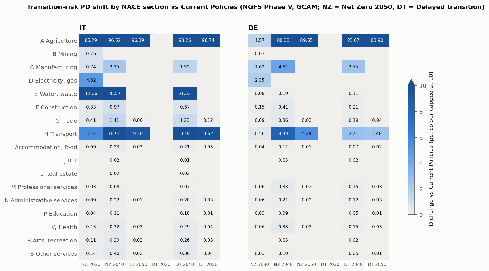
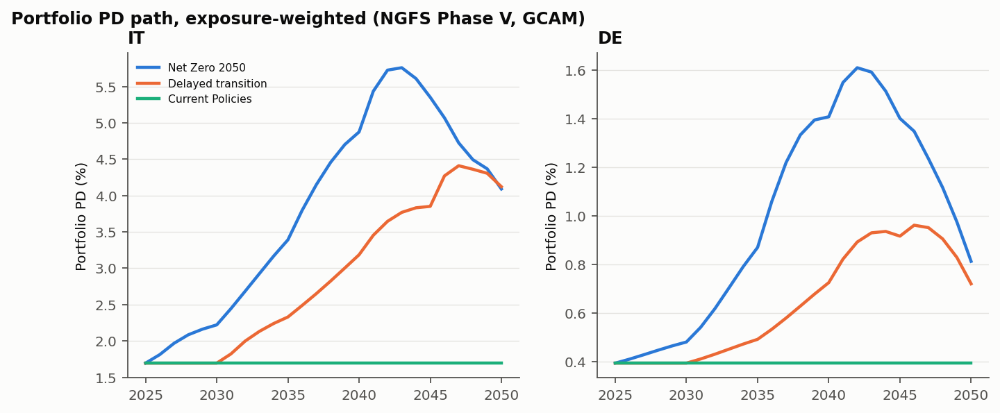
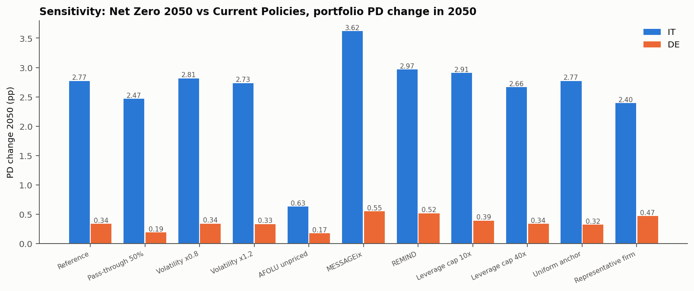

# Transition credit risk engine: NGFS scenarios to corporate PDs

An open, reproducible engine that translates **NGFS Phase V transition scenarios** into
**probabilities of default and expected loss** for a non-financial corporate loan book, by NACE
sector, for **Italy and Germany, 2025-2050**.

- **Transmission channels** follow the ECB economy-wide climate stress test (Occasional Paper 281): carbon cost on Scope 1 emissions, sector abatement, GDP.
- **PDs** come from a **Merton** structural model, calibrated on default rates disclosed in banks' **Pillar 3 (EU CR9)**.
- **Public data only:** NGFS/IIASA, Eurostat, Damodaran, Pillar 3 reports. Every number is traceable to a source, a page or a file hash.

Context: EBA/GL/2025/04 on environmental scenario analysis apply from 1 January 2027 and require
banks to integrate environmental risks into stress testing and resilience analysis.

**Full method, sources and limitations: [docs/technical-note.md](docs/technical-note.md).**

## Key results (Net Zero 2050 vs Current Policies, GCAM, no cost pass-through)

| Portfolio PD change | 2030 | 2040 | 2050 | Peak |
|---|---|---|---|---|
| Italy | +0.53 pp | +3.18 pp | +2.40 pp | +4.06 pp (2043) |
| Germany | +0.09 pp | +1.01 pp | +0.42 pp | +1.22 pp (2042) |

1. **Hump-shaped risk.** The PD increase peaks in the early 2040s. Carbon prices rise faster than sector emissions fall until then; afterwards decarbonisation shrinks the base the price applies to.
2. **Concentrated risk.** In 2040 the largest shifts are in agriculture, Italian waste management (+45 pp) and transport (+11 to +14 pp). Manufacturing moves +1.7 pp; most services move less than 0.1 pp.
3. **One assumption drives the Italian 2050 figure.** If agricultural CH4/N2O is exempt from the carbon price, the Italian 2050 shift falls from +2.40 pp to +0.37 pp. Model choice (MESSAGEix, REMIND) moves it by up to 0.7 pp.





## Run

```bash
python3 -m venv .venv && .venv/bin/pip install -r requirements.txt
.venv/bin/python scripts/download.py     # NGFS (IIASA), Eurostat, Damodaran into data/raw/
.venv/bin/python run.py config.toml      # writes results/
.venv/bin/python -m pytest tests         # 9 tests: Merton, calibration, channels, interpolation, validation
```

`data/raw/` is not versioned: the NGFS licence restricts redistribution of the scenario data.

## Layout

| Path | Content |
|---|---|
| `config.toml` | Every parameter, with its source |
| `data/ref/cr9_rows.csv` | Pillar 3 EU CR9 rows behind the PD anchors (bank, page, URL) |
| `data/ref/cq5_weights.csv` | Pillar 3 EU CQ5 loans by NACE section, used as exposure weights |
| `data/ref/sector_map.csv` | A64 industry to NACE section, NGFS emission sector, Damodaran industry |
| `tcr/scenarios.py` | NGFS paths: carbon price, sector emissions, GDP; annual interpolation |
| `tcr/portfolio.py` | Loan-tape validation; representative-firm portfolio from public data |
| `tcr/engine.py` | Carbon-cost projection, Merton PD, calibration |
| `tcr/report.py` | CSV outputs and charts |
| `results/` | PD paths by sector and portfolio, expected loss, sensitivities, rejected loans, manifest with input hashes |
| `docs/` | Technical note, original design spec, decision log |

## Using your own loan tape

`tcr.portfolio.validate` applies the input schema (loan_id, firm_id, country, nace, size_class,
revenue, ebitda, financial_debt, exposure, ghg_t). Rows that fail a rule go to
`results/rejected.csv` with the rule; none are dropped silently.

## Author

Marco Izzo. MIT licence for the code. Scenario data © NGFS/IIASA, used under its licence and not redistributed.
